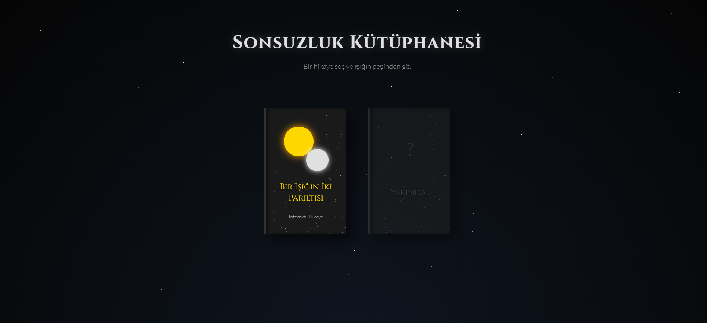
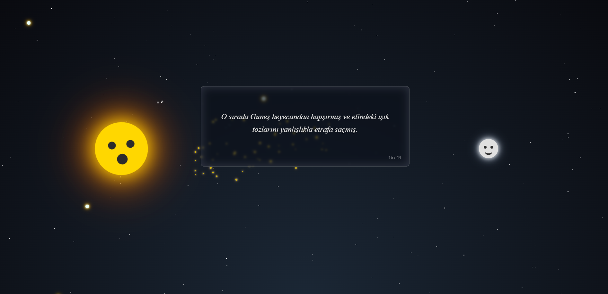

````markdown
# 📚 İnteraktif Kitaplık: Bir Işığın İki Parıltısı

> _"Gerçek dostlar, gökyüzünü paylaşmayı bilirler."_

**İnteraktif Kitaplık**, modern web teknolojileri kullanılarak hazırlanmış, çocuklara ve içindeki çocuğu kaybetmeyenlere yönelik sürükleyici bir dijital hikaye anlatıcılığı projesidir. Proje, ziyaretçileri 3 boyutlu bir kütüphane arayüzüyle karşılar ve seçilen kitaba tıklandığında, kaydırma (scroll) hareketleriyle yönetilen büyülü bir masala kapı aralar.

 

## 🌟 Proje Hakkında

Bu proje, statik bir okuma deneyimini dinamik bir maceraya dönüştürmeyi amaçlar. Hikaye, **Güneş ve Ay'ın** gökyüzündeki tatlı çekişmesini, birbirlerini anlamalarını ve dostluklarını anlatır.

Kullanıcı sayfayı aşağı kaydırdıkça:

- Metinler akar,
- Karakterler (Güneş ve Ay) hareket eder ve duygusal tepkiler verir,
- Arka plan ve atmosferik olaylar (yıldızlar, tutulmalar, ışık tozları) hikayenin akışına göre değişir.

## ✨ Temel Özellikler

- **3D Kütüphane Arayüzü:** CSS `transform-style: preserve-3d` kullanılarak oluşturulmuş, derinlik hissine sahip gerçekçi kitap rafı tasarımı.
- **Scroll-Tetikli Anlatım:** `Intersection Observer API` ile kullanıcının okuma hızına göre senkronize olan sahne geçişleri.
- **Dinamik Karakter İfadeleri:** Güneş ve Ay'ın yüz ifadeleri (mutlu, üzgün, şaşkın, kızgın) hikayenin duygusuna göre anlık değişir.
- **Gelişmiş Görsel Efektler:**
  - ✨ Rastgele oluşan ve parıldayan yıldızlar.
  - ☄️ Kayan yıldız animasyonları.
  - 🖱️ Mouse hareketini takip eden ışık izi (Cursor trail).
  - 🌬️ **Özel Parçacık Sistemi:** Güneş hapşırdığında ortaya çıkan ve yerçekimiyle düşen "ışık tozu" simülasyonu.
- **Anı Yıldızları:** Tıklandığında özel mesajlar içeren interaktif "Anı Yıldızları (Easter Egg)".
- **Responsive Tasarım:** Mobil, tablet ve masaüstü cihazlarla tam uyumlu.

## 🚀 Kullanılan Teknolojiler

Bu proje herhangi bir Framework (React, Vue vb.) veya kütüphane (jQuery) kullanılmadan, tamamen **Vanilla (Saf) JavaScript** ile geliştirilmiştir.

- **HTML5:** Semantik yapı ve SEO optimizasyonu.
- **CSS3:** Flexbox, Grid, Keyframe Animasyonları ve 3D Dönüşümler.
- **JavaScript (ES6+):** DOM manipülasyonu, Olay Dinleyicileri (Event Listeners) ve Mantıksal Akış.

## 📂 Dosya Yapısı

```text
interaktif-kitaplik/
├── index.html      # Ana Sayfa (3D Kütüphane Görünümü)
├── story1.html     # Hikaye Sayfası (Bir Işığın İki Parıltısı)
├── style.css       # Tüm stil, animasyon ve responsive kodları
├── script.js       # Hikaye motoru, etkileşimler ve animasyon mantığı
└── README.md       # Proje dökümantasyonu
```
````

## 🛠️ Kurulum ve Çalıştırma

Bu proje statik bir web sitesi olduğu için kurulum gerektirmez.

1.  Projeyi bilgisayarınıza klonlayın:
    ```bash
    git clone [https://github.com/YunusKok/interaktif-kitaplik.git](https://github.com/YunusKok/interaktif-kitaplik.git)
    ```
2.  Klasörün içindeki `index.html` dosyasına çift tıklayarak tarayıcınızda açın.
3.  Kütüphanedeki kitaba tıklayarak hikayeyi başlatın.

## 📸 Ekran Görüntüleri

|   3D Kütüphane Arayüzü    | İnteraktif Hikaye Sahnesi |
| :-----------------------: | :-----------------------: |
|  |       |

## 🔮 Gelecek Planları

- [ ] Kütüphaneye yeni interaktif hikayeler eklenmesi.
- [ ] "Kendi maceranı seç" (Choose your own adventure) yapısı.

## 📝 Lisans

Bu proje eğitim ve hobi amaçlı geliştirilmiştir. Kaynak gösterilerek özgürce kullanılabilir ve geliştirilebilir.

---

_Geliştirici: [Yunus Mert Kök](https://github.com/YunusKok)_
